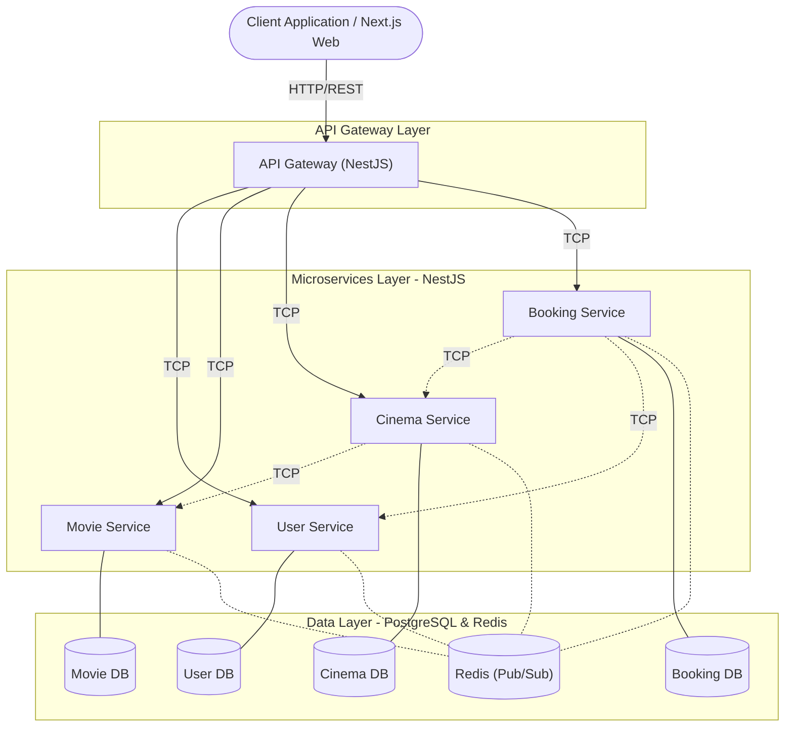

# Movie Hub

Movie Hub is a modern movie ticketing platform based on a microservices architecture built with **NestJS** (Backend), **Next.js** (Frontend), and managed using an **Nx Monorepo**.

## Core Features

- **User Management**: Authentication, profiles, and role-based access control.
- **Movie Catalog**: Movie exploration, viewing details, and scheduling.
- **Cinema Operations**: Management of theaters, showtimes, and seat layouts.
- **Booking System**: Real-time ticket booking and reservation handling.

## System Architecture Diagram



The system utilizes a hybrid communication approach between microservices:
- **TCP**: Used for direct, synchronous service-to-service communication to ensure fast and reliable data exchange.
- **Redis Pub/Sub**: Utilized for asynchronous event-driven communication, allowing services to broadcast and react to system-wide events decoupled from immediate execution.

## Architecture Overview

The system strictly follows a microservices architecture:

- **Frontend**: Next.js application.
- **API Gateway**: Single entry point for all client requests.
- **Microservices**: User, Movie, Cinema, and Booking services handling specific business domains.
- **Infrastructure**: Dockerized services using PostgreSQL (database per service) and Redis.

## Prerequisites

Before getting started, ensure you have the following tools installed:

- [Docker Desktop](https://www.docker.com/products/docker-desktop)
- [Node.js](https://nodejs.org/) (Version 20+ recommended)
- [Git](https://git-scm.com/)

## Getting Started

Follow these steps to run the system locally.

### 1. Clone Repository

```bash
git clone https://github.com/Tanh1603/movie-hub.git
cd movie-hub
```

### 2. Environment Variables

```env
# Database Configuration (.env.db)
POSTGRES_USER=postgres
POSTGRES_PASSWORD=postgres
POSTGRES_DB=movie_hub_<service_name>  # e.g., movie_hub_user, movie_hub_movie

# Service Configuration (.env)
TCP_HOST=0.0.0.0
DB_HOST=postgres-<service_name>       # e.g., postgres-user, postgres-movie
```

### 3. Run with Docker Compose

This command will build the images, start the databases, Redis, the backend microservices, and run data seeding scripts.

```bash
docker compose up -d --build
```

Wait a few minutes for the services to build and pass health checks. You can check the logs with:

```bash
docker compose logs -f
```

### 4. Start Frontend

Since the frontend is optimized for local development, run it outside of Docker:

```bash
# Install dependencies
npm install

# Start the web application
npx nx serve web
```

## Testing

To run the test suites across the project, use the standard Nx command:

```bash
npx nx test
```

## Deployment & Access URLs

Once everything is up and running, you can access the services at:

| Service | Access URL | Description |
| --- | --- | --- |
| **Frontend** | [http://localhost:4200](http://localhost:4200) | Main User Interface |
| **API Gateway** | [http://localhost:4000/api](http://localhost:4000/api) | Main API Endpoint |
| **Swagger Docs** | [http://localhost:4000/docs](http://localhost:4000/docs) | API Documentation |
| **User Service** | `localhost:4001` | TCP/Debugging Port |
| **Movie Service** | `localhost:4002` | TCP/Debugging Port |
| **Cinema Service** | `localhost:4003` | TCP/Debugging Port |
| **Booking Service** | `localhost:4004` | TCP/Debugging Port |

## Database Access (Optional)

If you have a database client (e.g., DBeaver, PGAdmin), you can connect to the databases via the following ports:

- **User DB**: `localhost:5435`
- **Movie DB**: `localhost:5436`
- **Cinema DB**: `localhost:5437`
- **Booking DB**: `localhost:5438`

## Contact Information

| Full Name | Role | Student ID | Email |
| :--- | :--- | :--- | :--- |
| Nguyễn Thiên An | Team Leader | 23520020 | 23520020@gm.uit.edu.vn |
| Nguyễn Lê Tuấn Anh | Member | 23520064 | 23520064@gm.uit.edu.vn |
| Lê Văn Huy | Member | 23520616 | 23520616@gm.uit.edu.vn |
| Quách Vĩnh Cơ | Member | 23520189 | 23520189@gm.uit.edu.vn |
| Điều Xuân Hiển | Member | 23520456 | 23520456@gm.uit.edu.vn |
| Phạm Hùng | Member | 23520573 | 23520573@gm.uit.edu.vn |
| Lưu Bình | Member | 23520156 | 23520156@gm.uit.edu.vn |
